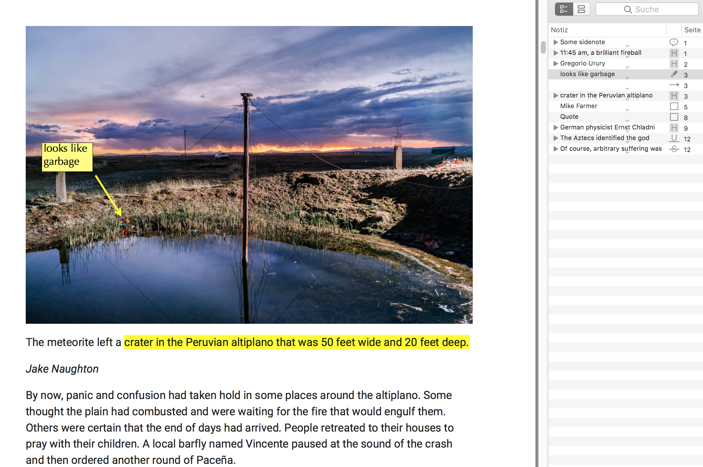
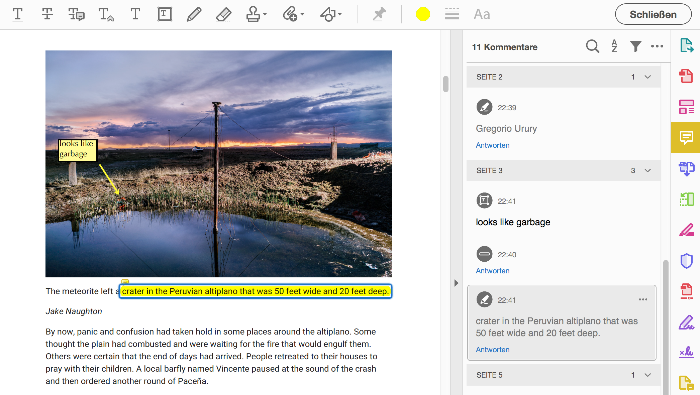

# SkimPDF

[Skim](https://skim-app.sourceforge.io/) is a PDF viewer with great search and annotation tools for OSX. It stores annotations in a non-standard format, thus the annotation can not viewed or edited in other PDF viewer like Adobe Acrobat Reader. However, Skim can convert Skim notes to standard PDF notes (embed) or make PDF notes editable in Skim (unembed).

PDF viewed in Skim with Skim annotations.

The same PDF with embedded annotations viewed in Adobe Acrobat Reader DC.

The Python class `SkimPDF` builds on `skimpdf` to automate the conversion step:

1. Embed notes
2. Unembed notes
3. Batch embed and unembed notes (works with nested folders; see below)

## Methods

* Convert Skim notes to PDF notes (embed): `skim.convert_to_pdf_notes('../path/to/pdf file.pdf')`
* Convert PDF notes to Skim notes (unembed): `skim.convert_to_skim_notes('../path/to/pdf file.pdf')`
* Batch convert notes in a folder: `skim.batch_convert_to_pdf_notes('../path/to/Literature folder')` and `skim.batch_convert_to_skim_notes('../path/to/Literature folder')`

## Batch processing

The methods `batch_convert_to_pdf_notes` and `batch_convert_to_skim_notes` batch embed and unembed notes. I have used it to embed Skim notes of 568 pdfs scattered in a folder with various subfolders. It took 5 minutes in total. Be aware, that the script won't process files with a `"` in its filepath.

## Available options

* Replace pdf or place a copy in place: `skim.replace_original = True` (default)
* If `skim.replace_original` is set to `False`, then you can set the embed or unembed suffix with `skim.embed_suffix` and `skim.unembed_suffix`

## Alfred Workflows

For ease of use, I have wrapped the python script in the [Alfred Workflows](https://www.alfredapp.com/) `PDF to Skim notes.alfredworkflow` and `Skim to PDF notes.alfredworkflow` to process one or more selected PDFs.

**WARNING:** The Alfred Workflows overwrite the selected files.
